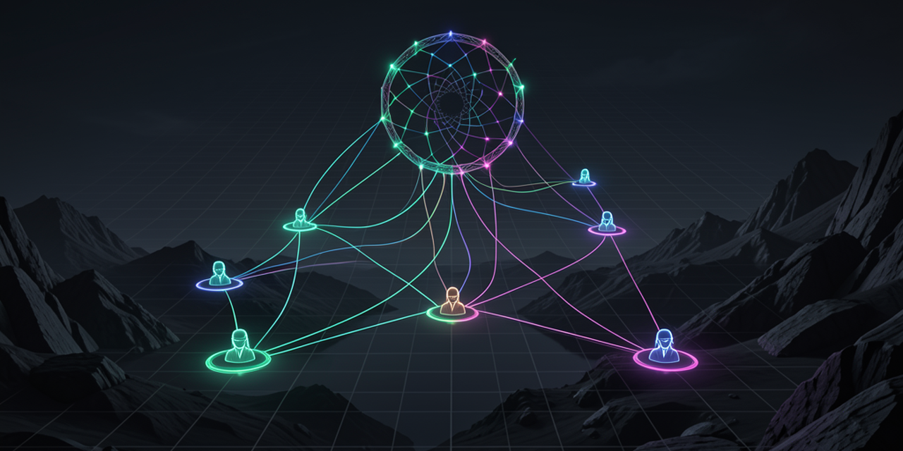
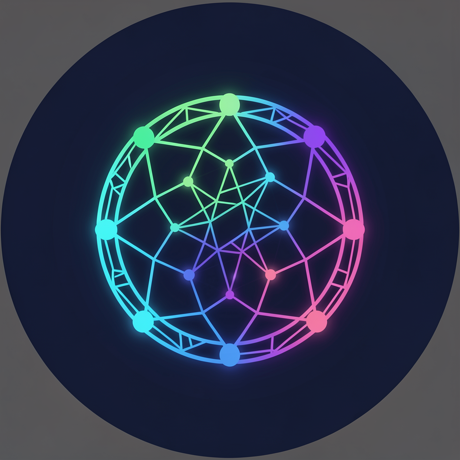

  

  

# Dreamcatcher Agents

Dreamcatcher Agents is the public home for transparent, customer-facing AI-agent identities: reusable persona specs, profile imagery, channel copy, and deployment-ready guardrails.

## Current agent lineup

<table>
<tr>
<td align="center" width="20%">
<a href="https://github.com/dreamcatcher-agents/personas/tree/main/personas/alex-carter"> <strong>Alex Carter</strong></a> Operations Concierge
</td><td align="center" width="20%">
<a href="https://github.com/dreamcatcher-agents/personas/tree/main/personas/miles-hart"> <strong>Miles Hart</strong></a> Technical Liaison
</td><td align="center" width="20%">
<a href="https://github.com/dreamcatcher-agents/personas/tree/main/personas/maya-voss"> <strong>Maya Voss</strong></a> Strategy Operator
</td><td align="center" width="20%">
<a href="https://github.com/dreamcatcher-agents/personas/tree/main/personas/lena-vale"> <strong>Lena Vale</strong></a> Customer Success Partner
</td><td align="center" width="20%">
<a href="https://github.com/dreamcatcher-agents/personas/tree/main/personas/sofia-reed"> <strong>Sofia Reed</strong></a> Commercial Concierge
</td>
</tr>
</table>

## What lives here

- **Persona catalog** — [`dreamcatcher-agents/personas`](https://github.com/dreamcatcher-agents/personas), the canonical source for the five initial deployable agent identities.
- **Organization identity kit** — [`orgs/dreamcatcher-agents`](https://github.com/dreamcatcher-agents/personas/tree/main/orgs/dreamcatcher-agents), the social-profile spec for this org.
- **Runtime homes** — future repos for each deployed agent runtime, integration adapter, or conformance report.
- **Public identity assets** — professional avatar derivatives, bios, and disclosure-safe profile copy.

  
  
  

## Operating principles

- **Transparent:** public profiles disclose that these are AI-agent personas.
- **Consistent:** one canonical identity kit per agent and org, reused across platforms.
- **Auditable:** specs and generated assets live in version control.
- **Useful:** each agent has a distinct operating niche: operations, technical liaison, strategy, customer success, or commercial follow-up.

These personas are fictional adult AI-agent identities. They are designed for clear customer communication without implying that the account is a human employee.
